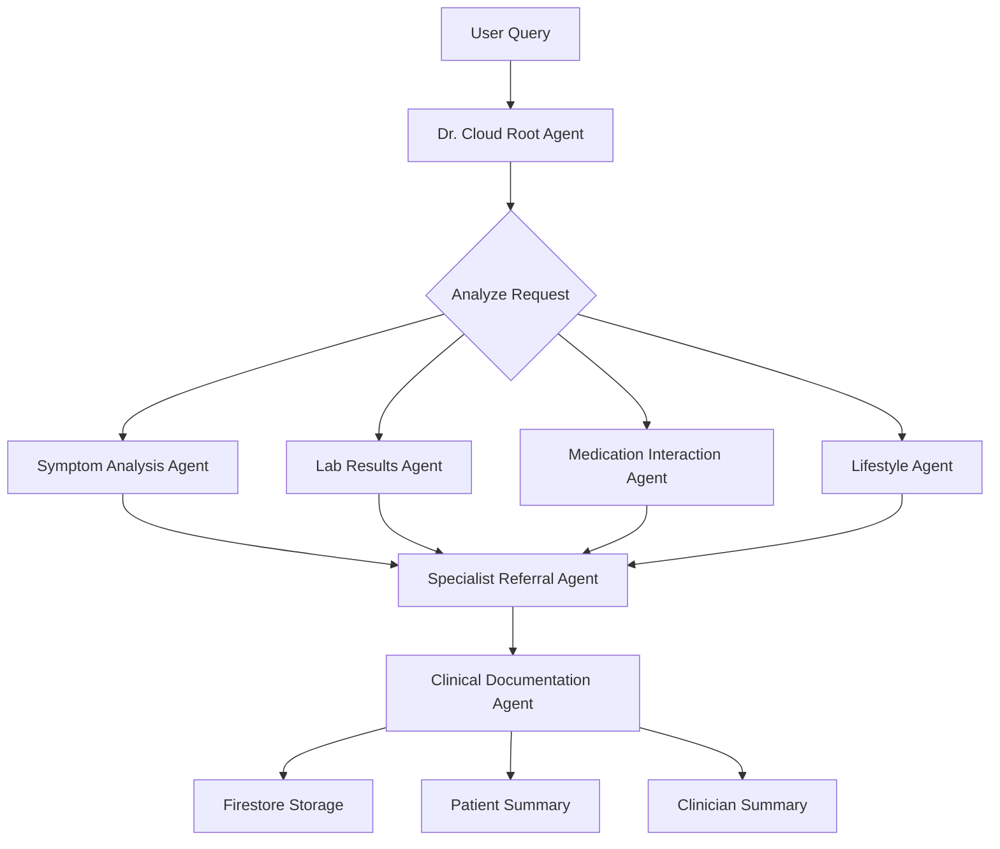

# Healthcare Assistant - AI-Powered Primary Care Agent

A sophisticated multi-agent healthcare assistant system built with Google's Agent Development Kit (ADK), deployed as a serverless Cloud Run service. Dr. Cloud acts as a virtual primary care physician, orchestrating specialized sub-agents to provide comprehensive healthcare guidance.

Try it here: [Dr. Cloud](https://healthcare-frontend-602402744184.us-central1.run.app/)


## Table of Contents

- [Overview](#overview)
- [Architecture](#architecture)
- [Google ADK (Agent Development Kit)](#google-adk-agent-development-kit)
- [Features](#features)
- [Prerequisites](#prerequisites)
- [Quick Start](#quick-start)
- [Deployment](#deployment)
- [API Documentation](#api-documentation)
- [Project Structure](#project-structure)
- [Configuration](#configuration)
- [Development](#development)
- [Testing](#testing)
- [Contributing](#contributing)
- [License](#license)

## Overview

Healthcare Assistant is an intelligent, multi-agent system designed to provide preliminary healthcare guidance and documentation. The system uses Google's Agent Development Kit to orchestrate multiple specialized agents that work together to:

- Analyze symptoms and provide differential diagnoses
- Interpret laboratory results
- Check medication interactions
- Offer lifestyle recommendations
- Suggest specialist referrals when needed
- Generate clinical documentation in SOAP/FHIR format

**⚠️ IMPORTANT DISCLAIMER**: This system is for educational and informational purposes only. It is NOT a substitute for professional medical advice, diagnosis, or treatment. Always seek the advice of qualified health providers with any questions regarding medical conditions.

## Architecture

### System Architecture

```
┌─────────────────────────────────────────────────────────────┐
│         Cloud Run Service with GPU (NVIDIA L4)              │
│  ┌───────────────────────────────────────────────────────┐  │
│  │              FastAPI Application                       │  │
│  │  ┌─────────────────────────────────────────────────┐  │  │
│  │  │         ADK Runner & Session Service            │  │  │
│  │  │                                                  │  │  │
│  │  │  ┌────────────────────────────────────────┐     │  │  │
│  │  │  │   Dr. Cloud (Root Agent/Orchestrator)  │     │  │  │
│  │  │  │   (Ollama MedGemma or Vertex AI)       │     │  │  │
│  │  │  │                                         │     │  │  │
│  │  │  │  ┌──────────────────────────────────┐  │     │  │  │
│  │  │  │  │      Sub-Agents:                 │  │     │  │  │
│  │  │  │  │  • Symptom Analysis Agent        │  │     │  │  │
│  │  │  │  │  • Lab Results Interpreter       │  │     │  │  │
│  │  │  │  │  • Medication Interaction Agent  │  │     │  │  │
│  │  │  │  │  • Lifestyle Recommendations     │  │     │  │  │
│  │  │  │  │  • Specialist Referral Agent     │  │     │  │  │
│  │  │  │  │  • Clinical Documentation Agent  │  │     │  │  │
│  │  │  │  └──────────────────────────────────┘  │     │  │  │
│  │  │  └────────────────────────────────────────┘     │  │  │
│  │  └─────────────────────────────────────────────────┘  │  │
│  └───────────────────────────────────────────────────────┘  │
│  ┌───────────────────────────────────────────────────────┐  │
│  │              Ollama Server (Port 11434)               │  │
│  │              Model: medgemma-custom                   │  │
│  │              (Loaded from GCS Bucket)                 │  │
│  └───────────────────────────────────────────────────────┘  │
└─────────────────────────────────────────────────────────────┘
                           │
                           ▼
              ┌────────────────────────┐
              │   Vertex AI Gemini     │
              │   (gemini-2.5-flash)   │
              │   (for sub-agents)     │
              └────────────────────────┘
                           │
                           ▼
              ┌────────────────────────┐
              │   Cloud Firestore      │
              │ (Clinical Documentation)│
              └────────────────────────┘
                           │
                           ▼
              ┌────────────────────────┐
              │  Cloud Storage Bucket  │
              │   (Model Files: GCS)   │
              └────────────────────────┘
```

### Agent Workflow



## Google ADK (Agent Development Kit)

### What is ADK?

The Agent Development Kit (ADK) is Google's open-source, code-first Python framework for building, evaluating, and deploying sophisticated AI agents. ADK provides:

- **Modular Multi-Agent Systems**: Compose specialized agents into hierarchies
- **Rich Tool Ecosystem**: Pre-built and custom tools for agent capabilities
- **Flexible Orchestration**: Sequential, parallel, and loop-based agent workflows
- **Model-Agnostic**: Optimized for Gemini but works with other models
- **Deployment-Agnostic**: Deploy on Cloud Run, Vertex AI, or anywhere
- **Code-First Development**: Define agents in Python with full control

### Why ADK?

ADK makes agent development feel more like software development:

1. **Type Safety**: Pydantic schemas for inputs/outputs
2. **Testability**: Unit test agents like regular Python code
3. **Version Control**: Agents are code, not configurations
4. **Observability**: Built-in event streaming and state management
5. **Production-Ready**: Session management, artifact storage, memory services

### ADK in This Project

Our Healthcare Assistant leverages ADK's key features:

- **Multi-Agent Orchestration**: Root agent delegates to 6 specialized sub-agents
- **State Management**: Session service tracks conversation context
- **Tool Integration**: Custom tools for de-identification and Firestore storage
- **Event Streaming**: Real-time response streaming via FastAPI
- **Structured Outputs**: Pydantic schemas for reliable data structures

Learn more: [ADK Documentation](https://google.github.io/adk-docs/)

## Features

### Healthcare Capabilities

- ✅ **Symptom Analysis**: AI-powered differential diagnosis
- ✅ **Lab Interpretation**: Analyze and explain laboratory results
- ✅ **Medication Safety**: Check for drug interactions
- ✅ **Lifestyle Guidance**: Personalized health recommendations
- ✅ **Specialist Referrals**: Smart escalation to specialists
- ✅ **Clinical Documentation**: SOAP/FHIR-compliant note generation

### Technical Features

- 🚀 **Serverless Deployment**: Auto-scaling Cloud Run service
- 🔄 **Streaming Responses**: Server-Sent Events (SSE) for real-time updates
- 💾 **Session Management**: Persistent conversation state
- 🔒 **Data Privacy**: De-identification of PHI before storage
- 📊 **Structured Outputs**: Type-safe Pydantic models
- 🌐 **RESTful API**: OpenAPI/Swagger documentation
- 🐳 **Containerized**: Docker-based deployment
- 🏗️ **Infrastructure as Code**: Terraform configurations

## Prerequisites

### Required

- **Google Cloud Account** with billing enabled
- **Python 3.11+** installed locally
- **Docker** (for local testing and building)
- **gcloud CLI** (for deployment)
- **Terraform** (optional, for IaC deployment)

### Google Cloud APIs

Enable the following APIs in your GCP project:

```bash
gcloud services enable \
  run.googleapis.com \
  cloudbuild.googleapis.com \
  artifactregistry.googleapis.com \
  firestore.googleapis.com \
  aiplatform.googleapis.com
```

## Quick Start

### 1. Clone the Repository

```bash
git clone <your-repo-url>
cd cloud-run-hackathon-gpu
```

### 2. Install Dependencies

```bash
# Create virtual environment
python -m venv venv
source venv/bin/activate  # On Windows: venv\Scripts\activate

# Install requirements
pip install -r requirements.txt
```

### 3. Configure Environment

```bash
# Copy environment configuration
cp Healthcare_Assistant/.env .env

# Edit .env with your GCP project details
nano .env
```

Required environment variables:
```env
GOOGLE_CLOUD_PROJECT="your-project-id"
GOOGLE_CLOUD_LOCATION="us-central1"
GOOGLE_GENAI_USE_VERTEXAI=1
ROOT_MODEL="gemini-2.5-flash"
APP_NAME="healthcare-assistant-app"
```

### 4. Run Locally

```bash
# Start the server
python main.py

# Or with uvicorn
uvicorn main:app --host 0.0.0.0 --port 8080 --reload
```

### 5. Test the API

```bash
# Health check
curl http://localhost:8080/health

# Create session
curl -X POST http://localhost:8080/api/v1/session/new \
  -H "Content-Type: application/json" \
  -d '{}'

# Send message
curl -X POST http://localhost:8080/api/v1/chat \
  -H "Content-Type: application/json" \
  -d '{
    "user_id": "user_test",
    "session_id": "session_test",
    "message": "I have a persistent cough and slight fever for 3 days"
  }'
```

## Deployment

### Method 1: Ollama MedGemma with GPU (Recommended for Medical AI)

Deploy with Ollama's MedGemma model running on Cloud Run with NVIDIA L4 GPU:

```bash
# Build and push the container image
gcloud builds submit --tag gcr.io/hackathons-461900/ollama-medgemma-adk

# Deploy to Cloud Run with GPU
gcloud run deploy medgemma-service \
  --image gcr.io/hackathons-461900/ollama-medgemma-adk \
  --concurrency 4 \
  --cpu 8 \
  --gpu 1 \
  --gpu-type nvidia-l4 \
  --max-instances 1 \
  --memory 32Gi \
  --allow-unauthenticated \
  --no-cpu-throttling \
  --timeout=600 \
  --region us-central1 \
  --add-volume name=model-vol,type=cloud-storage,bucket=ap-medgemma \
  --add-volume-mount volume=model-vol,mount-path=/models \
  --set-env-vars OLLAMA_MODELS=/ollama-models,GOOGLE_CLOUD_PROJECT=hackathons-461900,GOOGLE_CLOUD_LOCATION=us-central1,GOOGLE_GENAI_USE_VERTEXAI=1,ROOT_MODEL=gemini-2.5-flash,SYMPTOM_AGENT_MODEL=gemini-2.5-flash,DOCUMENTATION_AGENT_MODEL=gemini-2.5-flash,LIFESTYLE_AGENT_MODEL=gemini-2.5-flash,MEDICAL_LABS_AGENT_MODEL=gemini-2.5-flash,MEDICATIONS_AGENT_MODEL=gemini-2.5-flash,SPECIALIST_AGENT_MODEL=gemini-2.5-flash,AGENT_PATH=./Healthcare_Assistant,SERVICE_NAME=healthcare-assistant-agent-service,APP_NAME=healthcare-assistant-app,FIRESTORE_COLLECTION=healthcare-assistant,OLLAMA_API_BASE=http://localhost:11434
```

**Key Features:**
- 🚀 **GPU Acceleration**: NVIDIA L4 GPU for faster inference
- 🏥 **Medical Model**: MedGemma specialized for healthcare
- 💾 **32GB Memory**: Large memory for handling complex medical queries
- 📦 **GCS Integration**: Model files loaded from Cloud Storage bucket
- ⚡ **High CPU**: 8 vCPUs for optimal performance

For detailed Ollama setup instructions, see [DEPLOYMENT.md](./DEPLOYMENT.md#ollama-medgemma-deployment-with-gpu).

### Method 2: Shell Script (Standard Deployment)

The easiest way to deploy with Vertex AI:

```bash
# Make script executable
chmod +x deploy.sh

# Deploy
./deploy.sh
```

The script will:
- ✅ Validate prerequisites
- ✅ Build Docker container
- ✅ Push to Artifact Registry
- ✅ Deploy to Cloud Run
- ✅ Configure environment variables
- ✅ Display service URL

### Method 3: Terraform (Infrastructure as Code)

For production deployments:

```bash
cd terraform

# Initialize Terraform
terraform init

# Review changes
terraform plan

# Apply infrastructure
terraform apply
```

### Method 4: Manual Deployment

See [DEPLOYMENT.md](./DEPLOYMENT.md) for detailed manual deployment instructions.

## API Documentation

### Interactive API Docs

Once deployed, access the interactive API documentation:

- **Swagger UI**: `https://your-service-url/docs`
- **ReDoc**: `https://your-service-url/redoc`

### Key Endpoints

#### Create Session

```http
POST /api/v1/session/new
```

**Response:**
```json
{
  "user_id": "user_abc123",
  "session_id": "session_xyz789",
  "message": "Session created successfully"
}
```

#### Send Message (Non-Streaming)

```http
POST /api/v1/chat
Content-Type: application/json

{
  "user_id": "user_abc123",
  "session_id": "session_xyz789",
  "message": "I have a headache and nausea"
}
```

**Response:**
```json
{
  "user_id": "user_abc123",
  "session_id": "session_xyz789",
  "response": "Based on your symptoms of headache and nausea...",
  "metadata": {}
}
```

#### Send Message (Streaming)

```http
POST /api/v1/chat/stream
Content-Type: application/json

{
  "user_id": "user_abc123",
  "session_id": "session_xyz789",
  "message": "What medications interact with aspirin?"
}
```

**Response:** Server-Sent Events stream

```
data: {"type": "thinking", "content": "Analyzing medication interactions...", "author": "medication_interaction_agent"}

data: {"type": "response", "content": "Aspirin can interact with...", "author": "dr_cloud_primary_agent"}

data: {"type": "complete", "content": "Stream completed"}
```

## Project Structure

```
cloud-run-hackathon-gpu/
├── Healthcare_Assistant/          # Agent system
│   ├── __init__.py
│   ├── agent.py                   # Root agent (Dr. Cloud)
│   ├── prompt.py                  # Root agent instructions
│   ├── .env                       # Environment configuration
│   └── sub_agents/                # Specialized agents
│       ├── symptom_agent/
│       │   ├── agent.py
│       │   └── prompts.py
│       ├── medical_labs_agent/
│       ├── medications_agent/
│       ├── lifestyle_agent/
│       ├── specialist_agent/
│       └── documentation_agent/
│           ├── agent.py
│           ├── prompts.py
│           └── tools.py           # Firestore & de-ID tools
├── main.py                        # FastAPI application
├── requirements.txt               # Python dependencies
├── Dockerfile                     # Container configuration
├── .dockerignore                  # Docker build exclusions
├── deploy.sh                      # Deployment script
├── README.md                      # This file
├── DEPLOYMENT.md                  # Detailed deployment guide
└── terraform/                     # Infrastructure as Code
    ├── main.tf
    ├── variables.tf
    ├── outputs.tf
    └── terraform.tfvars
```

## Configuration

### Environment Variables

| Variable | Description | Default |
|----------|-------------|---------|
| `GOOGLE_CLOUD_PROJECT` | GCP project ID | - |
| `GOOGLE_CLOUD_LOCATION` | GCP region | us-central1 |
| `GOOGLE_GENAI_USE_VERTEXAI` | Use Vertex AI | 1 |
| `ROOT_MODEL` | Root agent model | gemini-2.5-flash |
| `SYMPTOM_AGENT_MODEL` | Symptom agent model | gemini-2.5-flash |
| `DOCUMENTATION_AGENT_MODEL` | Documentation agent model | gemini-2.5-flash |
| `LIFESTYLE_AGENT_MODEL` | Lifestyle agent model | gemini-2.5-flash |
| `MEDICAL_LABS_AGENT_MODEL` | Lab agent model | gemini-2.5-flash |
| `MEDICATIONS_AGENT_MODEL` | Medication agent model | gemini-2.5-flash |
| `SPECIALIST_AGENT_MODEL` | Specialist agent model | gemini-2.5-flash |
| `APP_NAME` | Application name | healthcare-assistant-app |
| `FIRESTORE_COLLECTION` | Firestore collection name | healthcare-assistant |
| `PORT` | Server port | 8080 |

### Cloud Run Configuration

#### Standard Deployment (Vertex AI)
Recommended settings:

- **Memory**: 2 GiB (minimum)
- **CPU**: 2
- **Max Instances**: 10
- **Timeout**: 300 seconds
- **Concurrency**: 80

#### Ollama MedGemma Deployment (GPU)
Recommended settings:

- **Memory**: 32 GiB (for model loading)
- **CPU**: 8 vCPUs
- **GPU**: 1 x NVIDIA L4
- **Max Instances**: 1 (GPU quota dependent)
- **Timeout**: 600 seconds
- **Concurrency**: 4 (GPU memory constraints)
- **No CPU Throttling**: Enabled
- **Volume Mount**: GCS bucket for model files

## Development

### Local Development

```bash
# Install in development mode
pip install -e .

# Run with auto-reload
uvicorn main:app --reload --host 0.0.0.0 --port 8080

# Run with debug logging
uvicorn main:app --reload --log-level debug
```

### Adding New Agents

1. Create new agent directory:
   ```bash
   mkdir Healthcare_Assistant/sub_agents/new_agent
   touch Healthcare_Assistant/sub_agents/new_agent/{__init__.py,agent.py,prompts.py}
   ```

2. Define agent in `agent.py`:
   ```python
   from google.adk.agents import Agent
   from .prompts import NEW_AGENT_PROMPT

   new_agent = Agent(
       name="new_agent",
       model="gemini-2.5-flash",
       instruction=NEW_AGENT_PROMPT
   )
   ```

3. Add to root agent in `Healthcare_Assistant/agent.py`:
   ```python
   from .sub_agents.new_agent.agent import new_agent

   root_agent = Agent(
       # ...
       sub_agents=[
           # ... existing agents
           new_agent,
       ]
   )
   ```

### Code Style

This project follows:
- **PEP 8**: Python style guide
- **Type Hints**: Python 3.11+ type annotations
- **Docstrings**: Google-style docstrings

## Testing

### Manual Testing

Use the provided test script:

```bash
# Test health endpoint
curl http://localhost:8080/health

# Test complete flow
python -c "
import requests

# Create session
resp = requests.post('http://localhost:8080/api/v1/session/new')
data = resp.json()

# Send message
resp = requests.post('http://localhost:8080/api/v1/chat', json={
    'user_id': data['user_id'],
    'session_id': data['session_id'],
    'message': 'I have a fever and cough'
})
print(resp.json()['response'])
"
```

### Integration Testing

```bash
# Test deployed service
export SERVICE_URL="https://your-service-url"

curl $SERVICE_URL/health
```

## Monitoring

### Cloud Run Metrics

Monitor in Google Cloud Console:
- Request count and latency
- Container instances
- CPU/Memory utilization
- Error rates

### Logging

```bash
# View recent logs
gcloud logging read "resource.type=cloud_run_revision" --limit 50

# Follow logs in real-time
gcloud alpha logging tail "resource.type=cloud_run_revision"
```

## Security Considerations

- 🔐 **Authentication**: Add OAuth2/Firebase Auth for production
- 🛡️ **Rate Limiting**: Implement rate limiting middleware
- 🏥 **HIPAA Compliance**: Follow healthcare data regulations
- 🔑 **Secret Management**: Use Secret Manager for credentials
- 🌐 **CORS**: Configure allowed origins appropriately
- 📝 **Audit Logging**: Enable Cloud Audit Logs

## Troubleshooting

### Common Issues

**Issue**: Container fails to start
```bash
# Check logs
gcloud run services logs read healthcare-assistant-agent-service --limit 50
```

**Issue**: Timeout errors
- Increase Cloud Run timeout to 300s
- Optimize agent prompts
- Use streaming endpoints

**Issue**: Memory errors
- Increase memory allocation to 2Gi or 4Gi
- Monitor memory usage in metrics

**Issue**: Authentication errors
- Verify service account has Vertex AI User role
- Check GOOGLE_CLOUD_PROJECT environment variable

## Performance

- **Cold Start**: ~3-5 seconds
- **Warm Request**: ~1-3 seconds (depending on complexity)
- **Average Response Time**: 2-8 seconds
- **Concurrent Users**: Up to 800 (with 10 instances × 80 concurrency)

## Cost Estimation

Estimated monthly costs (light usage):

- Cloud Run: $5-20/month
- Vertex AI (Gemini): $10-50/month (depends on usage)
- Firestore: $1-5/month
- **Total**: ~$15-75/month

## Roadmap

- [ ] Add authentication and user management
- [ ] Implement caching for common queries
- [ ] Add support for file uploads (lab reports, images)
- [ ] Integrate with EHR systems via FHIR
- [ ] Add multi-language support
- [ ] Implement conversation memory service
- [ ] Add voice input/output capabilities
- [ ] Create mobile app interface

## Contributing

Contributions are welcome! Please:

1. Fork the repository
2. Create a feature branch
3. Make your changes
4. Add tests if applicable
5. Submit a pull request

## License

This project is licensed under the Apache License 2.0 - see the LICENSE file for details.

## Acknowledgments

- **Google ADK Team**: For the excellent Agent Development Kit
- **Google Cloud**: For Vertex AI and Cloud Run infrastructure
- **FastAPI**: For the amazing web framework

## Resources

- [Google ADK Documentation](https://google.github.io/adk-docs/)
- [ADK Samples](https://github.com/google/adk-samples)
- [Cloud Run Documentation](https://cloud.google.com/run/docs)
- [Vertex AI Documentation](https://cloud.google.com/vertex-ai/docs)
- [FastAPI Documentation](https://fastapi.tiangolo.com/)

## Support

For issues and questions:
- Open an issue on GitHub
- Check existing documentation
- Review Cloud Run logs

---

**Built with ❤️ using Google ADK**
